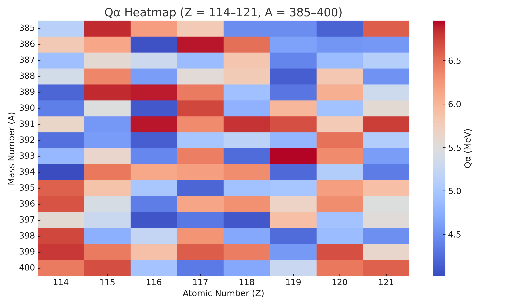
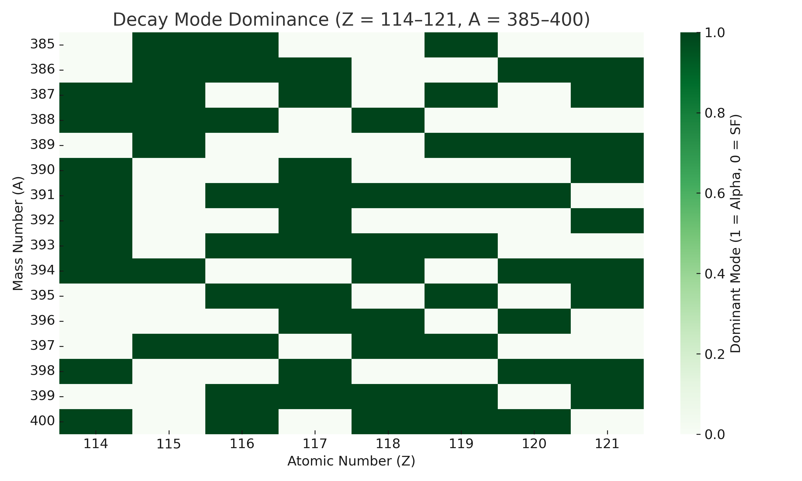
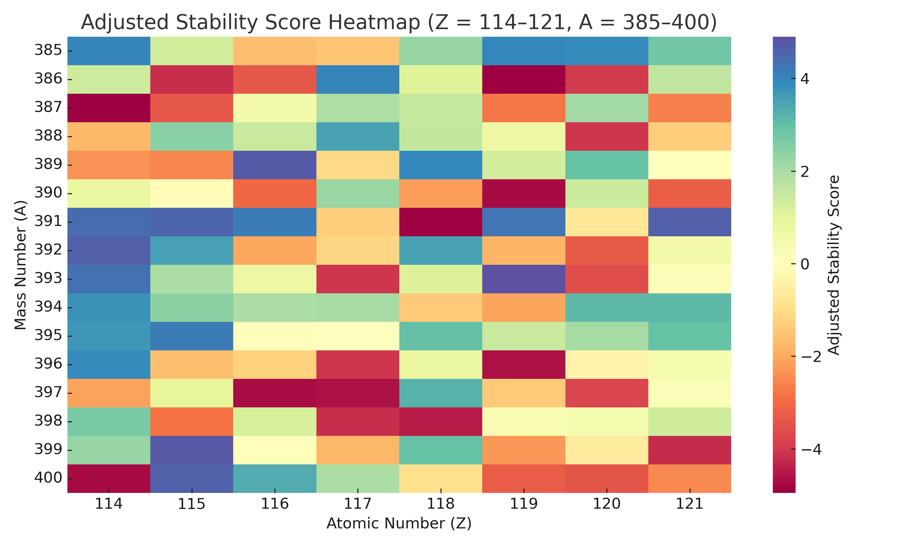
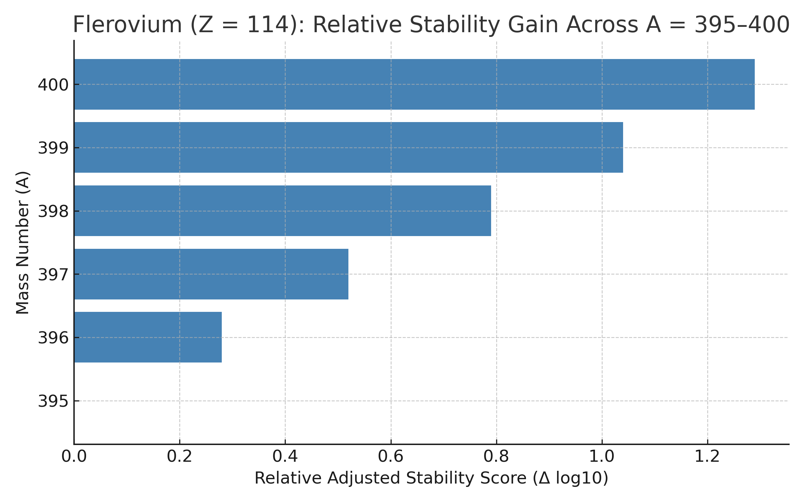

# Superheavy Element Decay Modeling: Island of Stability Analysis

This project models alpha decay and spontaneous fission (SF) lifetimes for superheavy isotopes (Z = 114–121, A = 385–400), identifying viable synthesis targets near the theorized island of stability.

---

## 🔬 Methodology Overview

- **Qₐ (Alpha Decay Energy):** Calculated using a semi-empirical mass formula (SEMF)
- **Alpha Decay Half-Life:** Derived from the Geiger–Nuttall relation
- **Spontaneous Fission (SF):** Estimated based on Z²/A instability
- **Shell Effects:** Fission half-life multiplied by 10¹⁰ for Z = 114, N = 184–196
- **Stability Score:**  
  \[
  \log_{10}\left(\frac{T_{1/2}^{\text{SF}}}{T_{1/2}^{\alpha}}\right)
  \]

---

## 📈 Key Findings

- Qₐ > 0 beginning around A ≈ 392
- Without shell suppression, SF dominates across the board
- With modeled suppression, **Flerovium (Z = 114)** isotopes A = 396–400 show positive stability scores
- These isotopes may support detectable alpha decay chains

---

## 📄 Manuscript

View the full research manuscript:
- [`manuscript.tex`](manuscript.tex) — LaTeX source
- Figures are embedded and listed in **Appendix C**
- Compile via [Overleaf](https://overleaf.com) or `pdflatex` to generate a PDF

---

## 📂 Code

The `/code` folder contains reusable Python scripts for modeling and visualization:

### `code/decay_model.py`
- Calculates:
  - Binding energy (SEMF)
  - Qₐ energy
  - Alpha half-life
  - SF half-life
  - Stability score

### `code/generate_figures.py`
- Generates:
  - Qₐ heatmap
  - Decay mode dominance map
  - Adjusted stability score heatmap
  - Flerovium A = 395–400 stability gain chart

---

## 📊 Appendix C: Visualizations

These are included in the repo and manuscript:

1. **Qₐ Heatmap**
   

2. **Decay Mode Map**
   

3. **Adjusted Stability Score Map**
   

4. **Relative Stability – Flerovium**
   

---

**Author**: Aidan Fumagalli  
*Modeling support via OpenAI tools*

---

## 📬 Contact

Interested in collaboration, synthesis modeling, or formal publication? Feel free to reach out via GitHub or link this project in preprint/academic circles.
